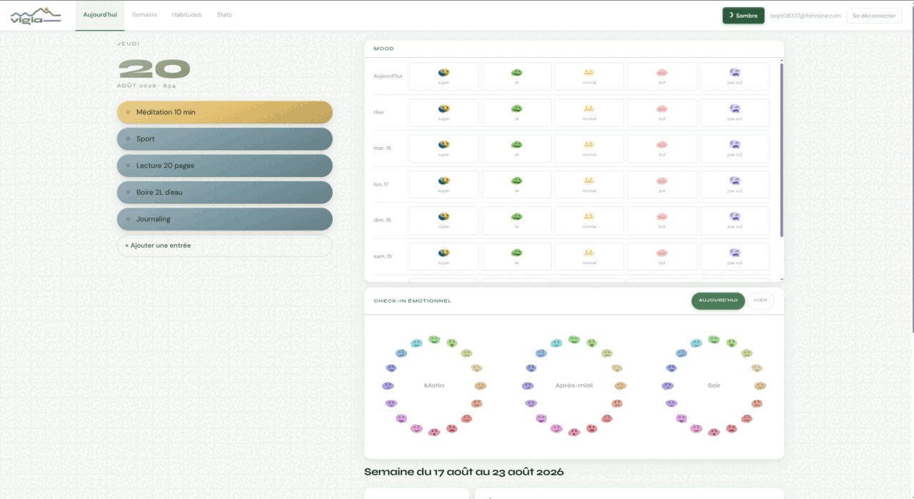
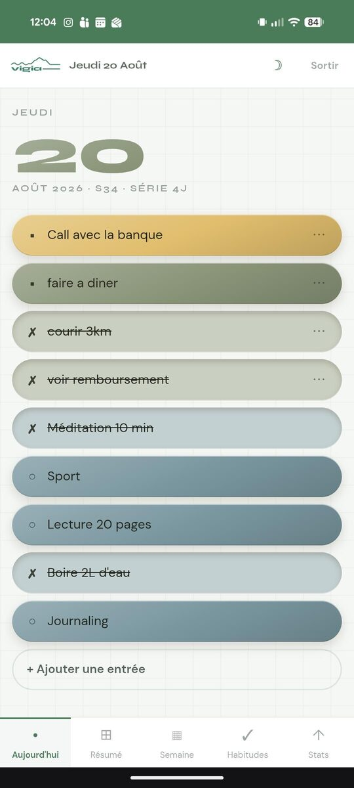
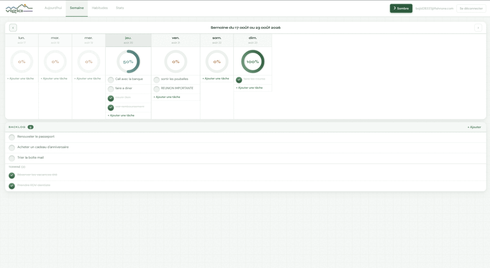
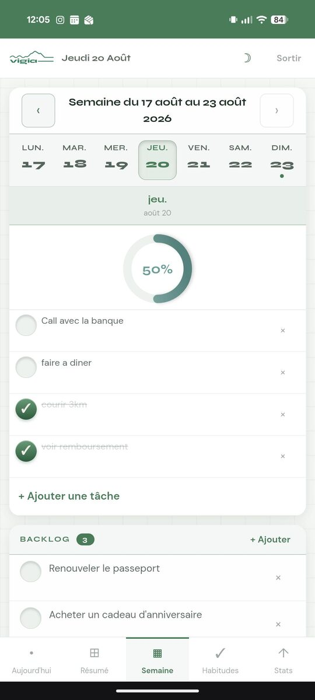
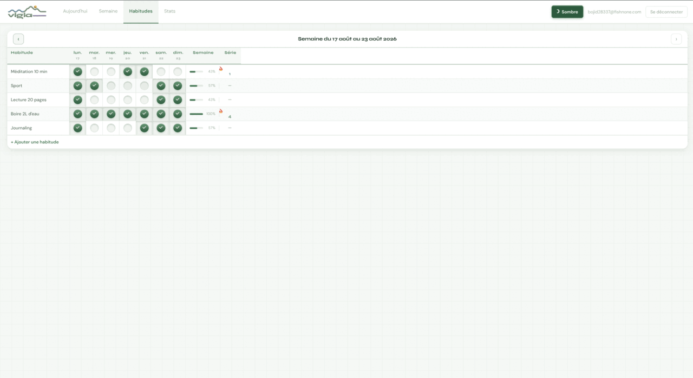
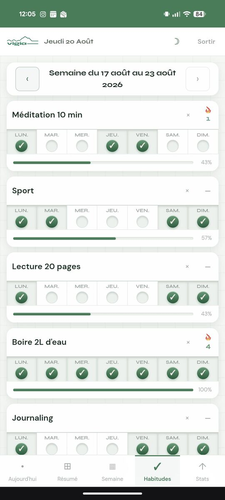
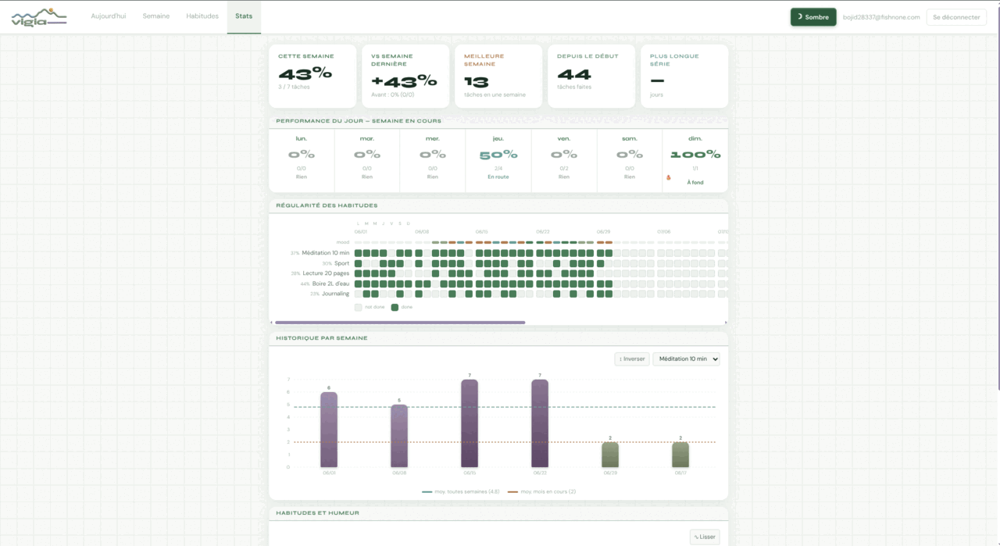
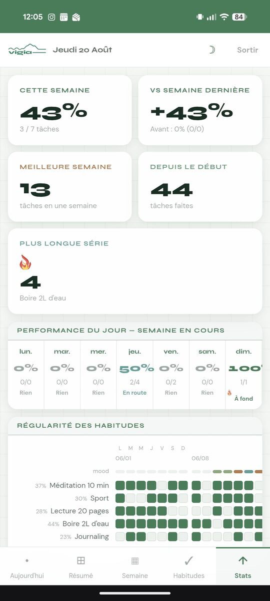

<p align="center">
  
</p>

<p align="center">
  A daily journal and habit tracker.<br>
  Write your day, check off your habits, log how you felt — and look back on the week.
</p>

<p align="center">
  <a href="https://vigia-murex.vercel.app/"><strong>Open vigia →</strong></a>
</p>

<p align="center">
  Create an account on the site and start writing. Nothing to install, nothing to
  configure.<br>
  On a phone, add it to your home screen and it works offline.
</p>

---

## Today

Your day in one list: tasks and habits together. Tap an entry to check it off, tap
the `⋯` for more — push it to tomorrow, rename it, or delete it. One entry is
highlighted as the next thing to do.

On a wide screen, today sits next to the week's summary.

| Web | Mobile |
| --- | --- |
|  |  |

## Week

Tasks laid out by day, with a timeless backlog for everything without a date.
Browse past weeks to review or fill them in. On a phone you pick a day and it fills
the screen.

Push a task to another day and it stays visible on both — struck through where it
was, live where it went.

| Web | Mobile |
| --- | --- |
|  |  |

## Habits

One row per habit, one box per day. Each shows how much of the week you've done and
how long your current run is. Past weeks stay editable.

| Web | Mobile |
| --- | --- |
|  |  |

## Stats

How you're doing over time: this week against last, your best week, your longest
run, a year-round consistency grid, and how your habits line up with your mood.

| Web | Mobile |
| --- | --- |
|  |  |

---

## What you can do

- **Write your day** — tasks and habits in a single list, pushed to tomorrow when
  they don't happen
- **Plan a week** — tasks per day, plus a backlog for anything undated
- **Track habits** — daily boxes, weekly rate, current run
- **Log your mood** — a score for the day, and three emotional check-ins (morning,
  afternoon, evening) picked from sixteen faces
- **Look back** — consistency grid, weekly history, and mood against habits
- **Use it anywhere** — installable on a phone, works offline, light and dark
- **Keep it private** — every row is scoped to your account in the database

## Stack

| Layer     | Tech                                  |
| --------- | ------------------------------------- |
| Frontend  | React 19, TypeScript 6, Vite 8        |
| Styling   | Tailwind CSS v4, Framer Motion        |
| Charts    | Recharts                              |
| Backend   | Supabase (Auth + PostgreSQL + RLS)    |
| PWA       | vite-plugin-pwa (Workbox, autoUpdate) |
| Utilities | date-fns, canvas-confetti             |

The interface is in French; the code is in English.

## Running your own copy

You don't need this to use vigia — [the site](https://vigia-murex.vercel.app/) is all
you need. This is for running it against your own Supabase project.

```bash
git clone https://github.com/LaNeigeLuge/vigia.git
cd vigia
npm install
cp .env.example .env
# Fill in VITE_SUPABASE_URL and VITE_SUPABASE_ANON_KEY
```

Run `supabase/schema.sql` in your Supabase project's SQL editor. It is idempotent
and complete — no extra steps.

```bash
npm run dev             # dev server
npm run dev -- --host   # reachable from your phone on the same network
```

```bash
npm run typecheck
npm run lint
npm test
npm run build
```

## Project layout

```text
src/
  App.tsx                  Auth gate and section routing
  ThemeContext.tsx         Light/dark provider
  theme.ts                 Design tokens
  components/
    Auth/                  Sign in / sign up
    Today/                 The daily list
    Dashboard/             Summary, mood picker, emotional check-ins
    WeeklyView/            Weekly planner and backlog
    HabitTracker/          Habit grid and cards
    Stats/                 Indicators, heatmap, charts
    layout/                Navigation
    ui/                    Shared controls and charts
  hooks/                   App state, auth session, breakpoints
  lib/                     Supabase client and queries
  types/                   Shared types
  utils/                   Dates, colors, data helpers
  assets/                  Only what the app imports
brand/                     Brand sources, not bundled
docs/screenshots/          README images
supabase/schema.sql        Schema with row-level security
```

### Data

| Type          | Fields                                                 |
| ------------- | ------------------------------------------------------ |
| `Task`        | id, text, completed, dayKey, weekStart, migratedTo     |
| `Habit`       | id, name, completions (day map), createdAt             |
| `Todo`        | id, text, completed, createdAt                         |
| `MoodValue`   | 1 to 5                                                 |
| `EmotionSlot` | `matin`, `apresmidi`, `soir`                           |
| `EmotionId`   | 16 values                                              |

Six tables in Supabase — `tasks`, `habits`, `habit_logs`, `todos`, `mood_logs`,
`emotional_checkins` — each with row-level security tying every row to its owner.

## Deploying

```bash
npm run build
npm run preview
```

The build is a static site. Deploy it to any static host (Vercel, Netlify,
Cloudflare Pages) with the same two environment variables set. On Vercel: build
command `npm run build`, output directory `dist`.

## License

Private project. Not published under an open-source license.
