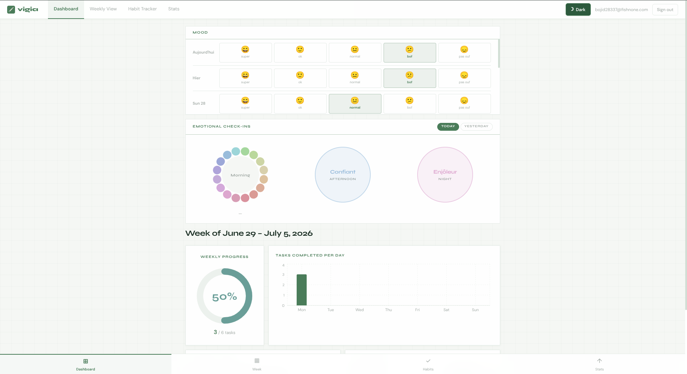
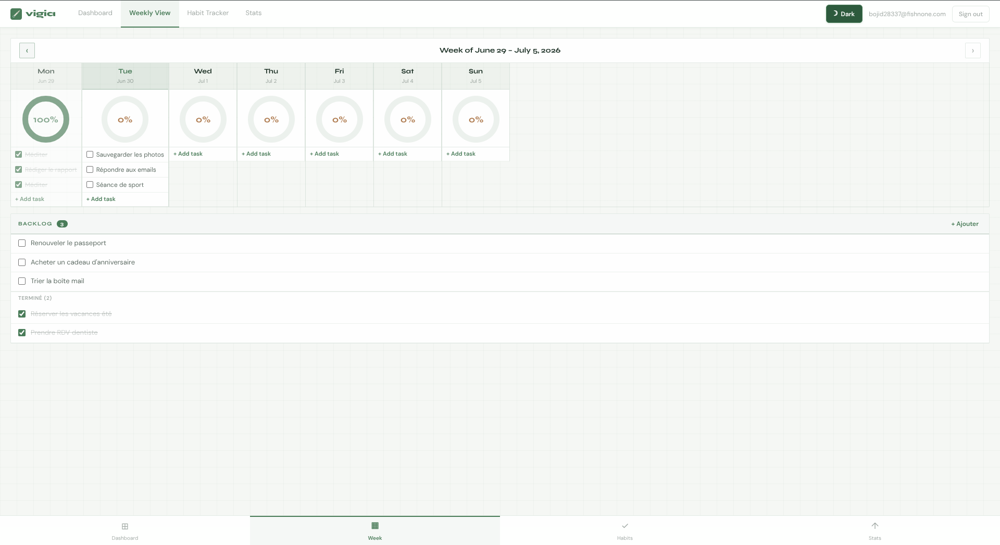
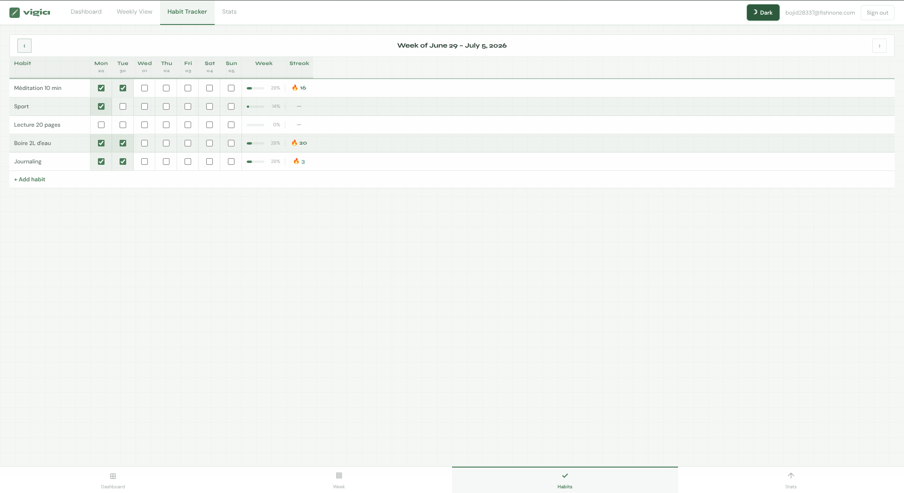
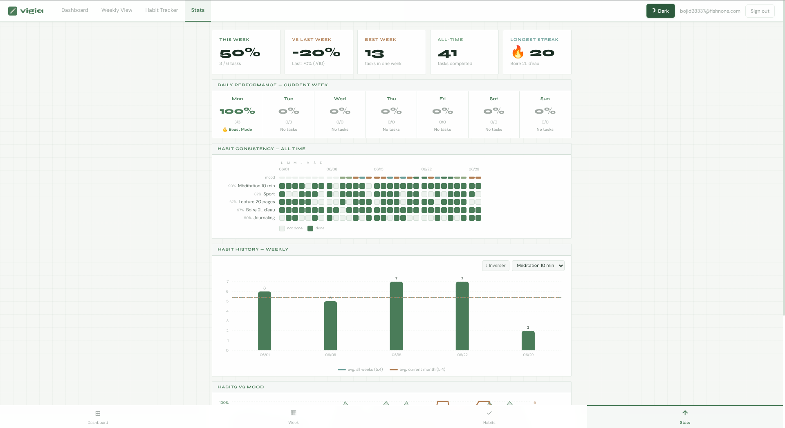

# vigia

A mobile-first productivity PWA — weekly task planner, habit tracker, mood logging, and emotional check-ins in a single app. Backed by Supabase with per-user data isolation via Row Level Security.



## Highlights

- **Emotional check-in wheels** — three time slots per day (morning, afternoon, night), each a 16-segment color wheel mapped to emotions. Pick one and the wheel collapses to a confirmed circle; click again to re-select.
- **Habit consistency heatmap** — GitHub-style contribution grid across all weeks, with a daily mood overlay so you can see how habits and mood track together.
- **Mood ↔ habit correlation** — a dual-axis chart that plots habit completion rate against daily mood, week over week.
- **Streaks that motivate** — live streak counters and weekly progress rings on every habit, with a "Beast Mode" callout on 100% days.
- **Optimistic writes** — local state updates instantly, the Supabase call fires in the background. The UI never waits on the network.
- **Installable & offline-capable** — Workbox service worker with network-first caching for Supabase, so the app keeps working without a connection.
- **Warm dark & light themes** — a shared token palette (emerald, amber, sage, aqua) with an instant toggle.

## Stack

| Layer     | Tech                                  |
| --------- | ------------------------------------- |
| Frontend  | React 19, TypeScript 6, Vite 8        |
| Styling   | Tailwind CSS v4, Framer Motion        |
| Charts    | Recharts                              |
| Backend   | Supabase (Auth + PostgreSQL + RLS)    |
| PWA       | vite-plugin-pwa (Workbox, autoUpdate) |
| Utilities | date-fns, canvas-confetti             |

## Screenshots

| Weekly planner | Habit tracker |
| --- | --- |
|  |  |



## Features

- **Dashboard** — week-at-a-glance with a weekly-progress donut, a daily-completions bar chart, habit streaks, and a daily quote
- **Weekly planner** — tasks organized by day; navigate to past weeks for review or retroactive edits, with a separate backlog
- **Habit tracker** — daily checkbox grid, per-habit weekly rate and streak, full edit access on past weeks
- **Mood tracking** — daily 1–5 score with scrollable history and editable past entries
- **Emotional check-ins** — morning / afternoon / night, each a 16-segment emotion wheel (today and yesterday)
- **Stats** — all-time KPIs (total tasks, best week, longest streak), consistency heatmap with mood overlay, and a habit-vs-mood correlation chart
- **Theming** — dark and light modes from a shared token palette
- **PWA** — installable on mobile, offline-capable via a Workbox service worker

## Architecture

```text
src/
  App.tsx                  Auth gate + section routing
  ThemeContext.tsx         Dark/light theme provider
  theme.ts                 Token definitions (colors, shadows)
  components/
    Auth/                  Sign-in / sign-up page
    Dashboard/             Dashboard, MoodPicker, EmotionalCheckIn
    WeeklyView/            Weekly task planner
    HabitTracker/          Habit grid with week navigation
    Stats/                 KPIs, HabitHeatmap, HabitCharts
    layout/                NavBar, BottomNav
    ui/                    DonutChart, ProgressBar
  hooks/
    useAppData.ts          Central state + optimistic DB writes
    useAuth.ts             Supabase auth session management
  lib/
    db.ts                  Supabase query layer (all CRUD)
    supabase.ts            Supabase client init
  types/
    index.ts               Shared type definitions
  utils/
    dataUtils.ts           Pure helpers (streaks, completion rates, quotes)
    dateUtils.ts           Date formatting and week math
supabase/
  schema.sql               Full DDL with RLS policies
```

### Data model

| Type          | Fields                                     |
| ------------- | ------------------------------------------ |
| `Task`        | id, text, completed, dayKey, weekStart     |
| `Habit`       | id, name, completions (day map), createdAt |
| `Todo`        | id, text, completed, createdAt             |
| `MoodValue`   | 1 through 5                                |
| `EmotionSlot` | matin, apresmidi, soir                     |
| `EmotionId`   | 16 values (heureux, confiant, triste, ...) |

### Database

Six tables in Supabase, all with RLS enforcing `auth.uid() = user_id`:

`tasks`, `habits`, `habit_logs`, `todos`, `mood_logs`, `emotional_checkins`

Writes are optimistic: local state updates immediately, then the DB call fires in the background. Errors are logged to console.

## Setup

Clone and install:

```bash
git clone https://github.com/LaNeigeLuge/vigia.git
cd vigia
npm install
```

Configure Supabase credentials:

```bash
cp .env.example .env
# Fill in VITE_SUPABASE_URL and VITE_SUPABASE_ANON_KEY
```

Apply the database schema. In your Supabase project SQL Editor, run the contents of `supabase/schema.sql`, then add the emotional check-ins table:

```sql
create table if not exists emotional_checkins (
  user_id uuid not null references auth.users(id) on delete cascade,
  day_key date not null,
  slot text not null check (slot in ('matin', 'apresmidi', 'soir')),
  emotion text not null,
  primary key (user_id, day_key, slot)
);

alter table emotional_checkins enable row level security;

create policy "emotional_checkins: own data only"
  on emotional_checkins for all
  using (auth.uid() = user_id)
  with check (auth.uid() = user_id);
```

Start the dev server:

```bash
npm run dev
```

## Build

```bash
# Production build
npm run build

# Preview the production build locally
npm run preview
```

## Deployment

The production build is a static site. Deploy to any static host (Vercel, Netlify, Cloudflare Pages) and set the same `VITE_SUPABASE_URL` and `VITE_SUPABASE_ANON_KEY` environment variables in your hosting provider.

The Vercel build command is `npm run build` with output directory `dist`.

## License

Private project. Not published under an open-source license.
